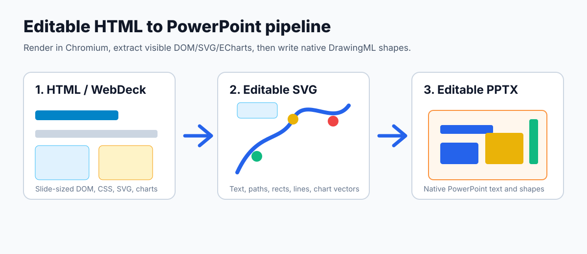

# html2pptx

将浏览器渲染后的 HTML/WebDeck 演示文稿转换为可编辑 PowerPoint PPTX。

大多数 HTML 转 PPTX 工具会把每页压平成图片。`html2pptx` 尽量把 DOM 文本、CSS 卡片/线条、SVG 原语和 ECharts 图表保留为 PowerPoint 原生可编辑对象。



流程是：用 Chromium 渲染 HTML，从真实 DOM/CSS/SVG/ECharts 中抽取可编辑 SVG 原语，再把 SVG 原语转换为 PowerPoint 原生 DrawingML 形状。

GitHub：<https://github.com/GX-Alex/html2pptx>

## 功能特性

- 输出可编辑 PPTX：文本、形状尽量保留为 PowerPoint 原生对象。
- 支持普通单页 HTML：没有 `.deck-slide` 的输入会自动包装成一页 1280x720 幻灯片。
- 更好的图表支持：将 ECharts 强制或重建为 SVG renderer，尽量导出为矢量原语。
- 更好的圆角框支持：四边一致的 CSS 圆角边框会转换为可编辑的带描边圆角矩形。
- 更好的图标支持：常见 Font Awesome Free solid 图标会先内联为 SVG path 再转换。
- 默认不使用整页截图兜底。
- 既可以作为 Codex skill 使用，也可以作为 Claude Code / opencode 的项目级 skill 或普通 CLI 使用。
- 附带空白图表、文本缺失、长网页页面、浏览器启动失败等排障说明。

## 为什么需要它

AI 生成 PPT、WebDeck 和 HTML 演示文稿通常先生成网页，但团队交付、审阅和二次编辑仍然依赖 PowerPoint。截图导出第一眼能看，但一旦需要改标题、调图表颜色、移动形状，就会变得很痛苦。

`html2pptx` 解决的是这个缝隙：优先保留 PPTX 的后续可编辑性，而不是把整页变成不可编辑图片。

## 适合使用场景

当源 HTML 本身就是“幻灯片形态”时，最适合使用本工具：

- WebDeck 风格文档，包含 `.deck-slide`、`.deck-stage`，并且每页是固定 16:9 画布。
- 普通单页 HTML，希望转换成一页 16:9 PPT 幻灯片。
- 每页按 1280x720 视口设计的 HTML 演示文稿。
- 需要保留 DOM 文本、CSS 卡片/线条、SVG 图示、ECharts 图表为可编辑对象的场景。
- 更重视 PPT 后续可编辑性，而不是截图级像素完全一致的场景。

如果源 HTML 本质是长网页、仪表盘、文章页，只是被塞进 slide 容器里，不建议只依赖这个可编辑导出流程。

## 环境要求

- Python 3.10+
- Node.js 18+
- Chrome 或 Chromium
- Python 依赖：`python-pptx`

安装最小依赖：

```bash
python -m pip install python-pptx
```

如果使用 Playwright Chromium：

```bash
python -m pip install playwright
python -m playwright install chromium
```

## 快速使用

从 GitHub 克隆并安装依赖：

```bash
git clone https://github.com/GX-Alex/html2pptx.git
cd html2pptx
python -m pip install -r requirements.txt
```

转换 HTML：

```bash
python skills/html2pptx/scripts/html2pptx.py input.html -o output.pptx
```

也可以先试内置示例：

```bash
python skills/html2pptx/scripts/html2pptx.py examples/basic-deck.html -o basic-deck.pptx
```

如果找不到 Chrome：

```bash
python skills/html2pptx/scripts/html2pptx.py input.html -o output.pptx \
  --chrome "/Applications/Google Chrome.app/Contents/MacOS/Google Chrome"
```

Windows 用户建议使用正斜杠路径，或 Git Bash 的 `/c/...` 路径：

```bash
python skills/html2pptx/scripts/html2pptx.py examples/basic-deck.html -o basic-deck.pptx \
  --chrome-path "C:/Program Files/Google/Chrome/Application/chrome.exe"
```

保留中间 SVG 方便调试：

```bash
python skills/html2pptx/scripts/html2pptx.py input.html -o output.pptx \
  --workdir /tmp/html2pptx-debug --keep-workdir
```

## 在智能体工具中使用

### Codex

将 skill 目录安装到 Codex 的 skills 目录：

```bash
mkdir -p "${CODEX_HOME:-$HOME/.codex}/skills"
cp -R skills/html2pptx "${CODEX_HOME:-$HOME/.codex}/skills/html2pptx"
```

然后这样调用：

```text
Use $html2pptx to convert this HTML deck into an editable PPTX.
```

Codex 会读取 `skills/html2pptx/SKILL.md`，然后调用内置脚本完成转换。

### Claude Code

Claude Code 的项目级 skill 入口位于：

```text
.claude/skills/html2pptx/SKILL.md
```

使用方式：

1. 在 Claude Code 中打开克隆后的 `html2pptx` 仓库。
2. 让 Claude Code 使用 `html2pptx` skill，例如：

```text
Use the html2pptx skill in this repository to convert deck.html to deck.pptx.
```

3. Claude Code 会读取 `.claude/skills/html2pptx/SKILL.md`，再调用共享脚本：

```bash
python skills/html2pptx/scripts/html2pptx.py deck.html -o deck.pptx
```

如果不想通过 skill，也可以直接运行上面的 CLI。

### opencode

opencode 也可以发现本仓库中的项目级 skill：

```text
.claude/skills/html2pptx/SKILL.md
```

使用方式：

1. 在 opencode 中打开克隆后的 `html2pptx` 仓库。
2. 让 opencode 使用 `html2pptx` skill，例如：

```text
Use the html2pptx skill to convert deck.html into an editable PowerPoint file.
```

3. opencode 会按 `AGENTS.md` / `OPENCODE.md` 的仓库级说明，调用同一个 CLI 包装脚本：

```bash
python skills/html2pptx/scripts/html2pptx.py deck.html -o deck.pptx
```

也就是说，Claude Code 和 opencode 使用的是 `.claude/skills/html2pptx/SKILL.md` 这个项目级 skill 入口；真正的转换实现仍统一放在 `skills/html2pptx`，避免多份脚本互相漂移。

## 验证是否可编辑

```bash
python - <<'PY'
from zipfile import ZipFile
p = "output.pptx"
with ZipFile(p) as z:
    slides = [n for n in z.namelist() if n.startswith("ppt/slides/slide") and n.endswith(".xml")]
    sp = sum(z.read(n).count(b"<p:sp") for n in slides)
    pic = sum(z.read(n).count(b"<p:pic") for n in slides)
print("slides", len(slides), "editable shapes", sp, "pictures", pic)
PY
```

通常 `pictures=0` 表示没有使用整页图片兜底。

## 已知限制

- 长网页式页面会被裁剪到 1280x720 视口。
- slide 内嵌完整 `<!doctype html><html>...` 文档时，可能需要预处理。
- CSS 伪元素、外部 icon font、filter、shadow、复杂 mask 等可能退化。
- 沙箱环境中浏览器启动可能需要显式传入 `--chrome`。

## 典型失败场景：slide 内嵌完整网页

有些生成器会把完整网页塞进每一页 slide，例如：

```html
<div class="deck-stage">
  <!doctype html>
  <html>
    <head>...</head>
    <body>...</body>
  </html>
</div>
```

这不是正常的幻灯片片段。浏览器会自动修正这种非法 DOM，抽取器可能只能看到部分内容。如果这个内嵌页面还是 `100vh` 或可滚动长网页布局，超出 1280x720 首屏的内容会被裁剪，或者落到 PPT 页面外。上一个 Hermes 案例中转换效果不好的页面就属于这一类：页面内容是完整网页/长网页式复杂布局，而不是固定 16:9 slide fragment。解决方式是先把 HTML 预处理成真正的单页幻灯片片段，或把长页面拆分/重排后再转换。

## 增加项目曝光

- 按 `docs/PROMOTION.md` 中的建议添加 GitHub topics。
- 用 `assets/social-preview.svg` 生成仓库 social preview。
- 按 `CHANGELOG.md` 发布第一个 `v0.1.0` release。
- 使用 `docs/PROMOTION.md` 中的中英文发布文案。
- 使用 `.github/ISSUE_TEMPLATE/` 中的模板收集 bug、功能建议和 good-first-issue。
